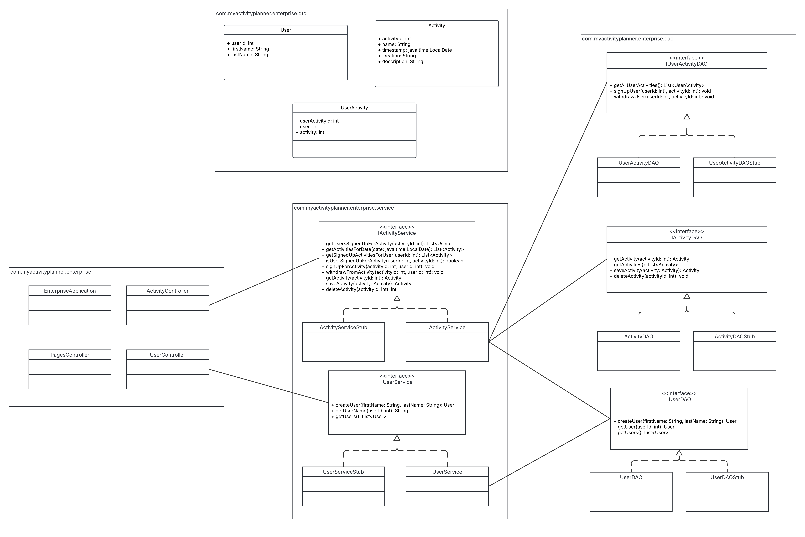

# My Activity Planner

IT4045C Enterprise Application Development

## Introduction

My Activity Planner is an application for individuals living in assisted living that allows them to see a list of activities for a given day and sign up for them.
An administration page allows management of the activities, including creating new activities, editing existing activities, and deleting activities.
Users of the app can view activities day by day with details including the activity name, date and time, location, and description. Users can sign up for activities, view the activities they have signed up for, and withdraw from activities.

## Storyboard

<!-- Screen mockups of application. -->

## Functional Requirements

### 1. As a user, I can "log in" as a specific user ID so that I can manage my activity list

**Given**: The application is not open

**When**: The application is loaded to the default page

**Then**: The user is prompted to enter a user ID

---

### 2. As a user of the application, I can act as a specific user ID so that I can have a separate activity list from other users

**Given**: The application is open to the default page

**When**: The user enters their user ID

**Then**: The user of the application performs tasks as that user ID

---

### 3. As a user of the application, I can only act as a valid user ID so that I do not lose my data

**Given**: The application is open to the default page

**When**: The user enters an invalid user ID

**Then**: An error message is shown stating "This user does not exist!"

---

### 4. As a user, I can view a list of all upcoming activities today so that I can see what is happening

**Given**: The user has authenticated

**When**: The application is loaded to the default page

**Then**: All available activities for today are shown in chronological order

---

**Given**: The user has authenticated, and a date other than today is currently selected

**When**: The user clicks on Today

**Then**: All available activities for today are shown in chronological order

---

### 5. As a user, I can switch the selected day to a different day so that I can view a list of all upcoming activities on that day

**Given**: The user has authenticated, and a date is selected

**When**: The user clicks on a different date

**Then**: All available activities for that day are shown in chronological order

---

### 6. As a user, I can see a list of activities I have signed up for on "My Activity List" so that I can know what I am supposed to be doing

**Given**: The user has authenticated, and the application is loaded to the default page

**When**: The user clicks "My Activity List"

**Then**: A list of activities the user has signed up for is visible with entries containing activity name, date, and time

---

### 7. As a user, I can view details about a specific activity so that I can be informed about what I can sign up for

**Given**: A list of activities is shown for the selected day

**When**: The user clicks on a specific activity

**Then**: Details about that activity are displayed, including activity name, date, time, location, and brief description, as well as a list of users that have already signed up for that activity.

---

**Given**: The user has authenticated, and the user is looking at their activity list

**When**: The user clicks on a specific activity

**Then**: Details about that activity are displayed, including activity name, date, time, location, and brief description, as well as a list of users that have already signed up for that activity.

---

### 8. As a user, I can add an activity to My Activity List so that I can attend them

**Given**: The user has authenticated, and a specific activity is currently being viewed that is not already part of the user's "My Activity List"

**When**: The user clicks "Add to My Activities"

**Then**: The activity is added to the user's list of activities

---

**Given**: A user is adding an activity to their activity list and has clicked "Add to My Activities"

**When**: The activity has successfully been added

**Then**: A success confirmation is displayed to the user with the message `<activity name> at <date and time> has been added to your activities.`

---

**Given**: A specific activity is currently being viewed that is not already part of the user's "My Activity List" and occurs at the same time as another activity on the user's "My Activity List"

**When**: The user clicks "Add to My Activities"

**Then**: A failure message is displayed to the user with the message `You already have an activity at this time!` and the activity is not added to the user's activity list

---

### 9. As a user, I can remove an activity from My Activity List so that I can withdraw my interest in an activity I had previously signed up for

**Given**: The user has authenticated, and a specific activity is currently being viewed that is already part of the user's "My Activity List"

**When**: The user clicks "Remove from My Activities"

**Then**: The activity is removed from the user's list of activities

---

**Given**: A user is removing an activity from their activity list and has clicked "Remove from My Activities"

**When**: The activity has successfully been removed

**Then**: A success confirmation is displayed to the user with the message `<activity name> at <date and time> has been removed from your activities.`

---

### 10. As an admin, I can create new activities so that I can make them available to users

**Given**: The admin page is open and the user has entered data in fields: name, date and time, location, and description

**When**: The user clicks "Add Activity"

**Then**: The activity is created and a success confirmation is displayed with the message `<activity name> at <date and time> has been created.` and the input fields are cleared

---

**Given**: The admin page is open and the user has entered data in the name, location, or description fields with more than 20 characters in the name field, 50 characters in the location field, or 500 characters in the description field

**When**: The user clicks "Add Activity"

**Then**: An error message is returned indicating which maximum character length was violated (20 for name, 50 for location, 500 for description)

---

**Given**: The admin page is open and the user has entered data in date and time fields with the selected date and time in the past

**When**: The user clicks "Add Activity"

**Then**: An error message is returned indicating the activity could not be created in the past

---

### 11. As an admin, I can modify existing activities so that I can make corrections

**Given**: The admin page is open

**When**: The user clicks the edit button on an existing activity

**Then**: The existing name, date and time, and description of the activity are loaded into the edit fields

---

**Given**: The admin page is open and the user is editing an activity

**When**: The user clicks "Save Activity"

**Then**: The activity is updated and a success confirmation is displayed with the message `The activity has been updated.` Additionally, the input fields are cleared and the button reverts back to a "Add Activity" button

---

### 12. As an admin, I can delete activities so that I can cancel activities

**Given**: The admin page is open

**When**: The user clicks the delete button on an existing activity

**Then**: The activity is deleted and a success confirmation is displayed with the message `<activity name> at <date and time> has been deleted.`

---

### 13. As an admin, I can create new users so that I can allow users to be able to log in

**Given**: The admin page is open and the user has entered data in fields: first name, last name

**When**: The user clicks "Add User"

**Then**: The user is created and a success confirmation is displayed with the message `User has been created with ID: <new user ID>` and the input fields are cleared

---

**Given**: The admin page is open and the user has entered data in fields: first name, last name with more than 50 characters in either field

**When**: The user clicks "Add User"

**Then**: An error message is returned indicating that the maximum length of first or last name is 50 characters.

## Class Diagram



[View it on LucidChart](https://lucid.app/lucidchart/182d23de-7ba1-4009-b43e-6455d03dbf5d/edit?invitationId=inv_3bcc0d16-4830-4a5c-ab85-9cdeda8fb1b8)

### Class Diagram Descriptions

#### Classes:

```
com.myactivityplanner.enterprise:
- EnterpriseApplication: Start up application server
- ActivityController: Endpoints for working with activities
- UserController: Endpoints for working with users

com.myactivityplanner.enterprise.dto:
- User: Store user information
- Activity: Store activity information

com.myactivityplanner.enterprise.service:
- ActivityServiceStub: Stub class for activity service
- ActivityService: Handle business logic for activities
- UserServiceStub: Stub class for user service
- UserService: Handle business logic for users

com.myactivityplanner.enterprise.dao:
- UserActivityDAO: Handle persistence for mapping users to activities
- UserActivityDAOStub: Stub class for persisting the mappings between users and activities
- ActivityDAO: Handle persistence for activities
- ActivityDAOStub: Stub class for activity persistence
- UserDAO: Handle persistence for users
- UserDAOStub: Stub class for user persistence
```

#### Interfaces:

```
com.myactivityplanner.enterprise.service:
- IActivityService: Interface for activity service; to be implemented by ActivityService
- IUserService: Interface for user service; to be implemented by UserService

com.myactivityplanner.enterprise.dao:
- IActivityDAO: Interface for persisting activities; to be implemented by ActivityDAO
- IUserDAO: Interface for persisting users; to be implemented by UserDAO
```

#### Methods:

```
IActivityService:
- getUsersSignedUpForActivity(activityId: int): List<User> - Returns a list of users who have signed up for a specific activity
- getActivitiesForDate(date: java.util.Date): List<Activity> - Returns a list of Activity objects that occur on the specified Date
- getSignedUpActivitiesForUser(userId: int): List<Activity> - Returns a list of Activity objects that the specified user has signed up for.
- isUserSignedUpForActivity(userId: int, activityId: int): boolean - Returns true if the specified user is signed up for the specified activity
- signUpForActivity(activityId: int, userId: int): boolean - Signs the specified user up for the specified activity
- withdrawFromActivity(activityId: int, userId: int): boolean

IUserService:
- getUserName(userId: int): String - Return the full name of the specified user in the format firstname, lastname

IUserActivityDAO:
- isUserSignedUpForActivity(userId: int, activityId: int): boolean - Returns true if the specified user is signed up for the specified activity
- signUpUser(userId: int, activityId: int): boolean - Creates a record in the UserActivity table with the specified userId and activityId. Returns true if successful.
- withdrawUser(userId: int, activityId: int): boolean - Deletes a record in the UserActivity table with the specified userId and activityId. Returns true if successful.

IActivityDAO:
- getActivity(activityId: int): Activity - Returns an Activity object by ID
- getActivities(): List<Activity> - Returns a list of all Activity objects
- saveActivity(activity: Activity): boolean - Update an existing Activity if it exists, otherwise, create a new Activity. Returns true if successful, otherwise, false.
- deleteActivity(activityId: int): boolean - Delete an Activity. Returns true if successful, otherwise, false.

IUserDAO:
- createUser(firstName: String, lastName: String): boolean - Create a new User with the specified first and last name. Returns true if successful, otherwise, false.
- getUser(userId: int): User - Get a user by ID
```

## JSON Schema

JSON schema for use in a third-party app. This provides full information about a user's "My Activity List":

```json
{
  "type": "object",
  "properties": {
    "userId": {
      "type": "integer"
    },
    "activities": {
      "type": "array",
      "items": [
        {
          "type": "object",
          "properties": {
            "id": {
              "type": "integer"
            },
            "name": {
              "type": "string"
            },
            "description": {
              "type": "string"
            },
            "location": {
              "type": "string"
            },
            "timestamp": {
              "type": "string"
            }
          },
          "required": [
            "id",
            "name",
            "description",
            "location",
            "timestamp"
          ]
        }
      ]
    }
  },
  "required": [
    "userId",
    "activities"
  ]
}
```

## Scrum roles

**UI Specialists**: Abdoul S, Brian M

**Business Logic/Persistence Specialists**: Evan S, Jacob G

**Product Owner/Scrum Master/DevOps Specialist**: Jacob G

## Project Link

https://github.com/OneYellowLemon/MyActivityPlanner

## Milestones

<!-- Links to milestones once created -->

## Standup Meeting

We meet every Wednesday at 4:30 pm EST.

> [!NOTE]
> Link not public due to public repository. Link has been shared with team.

<details>
    <summary>Why is it not public?</summary>

    As this is a public repository, we do not want our standup link public. As per the assignment instructions: If your repo is public, and  you prefer not to put the Teams link there, no problem... just email it to me and your group members.  However, you should still list the date and time of your weekly meeting(s).

</details>
